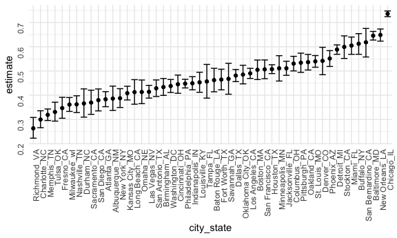
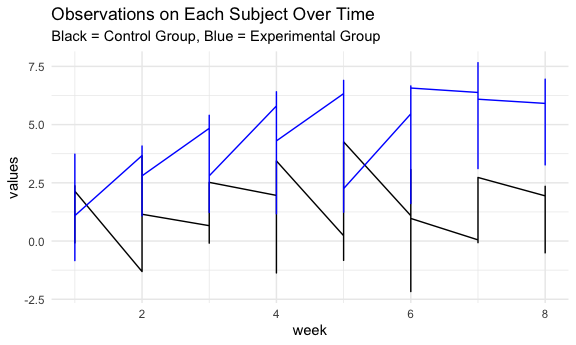
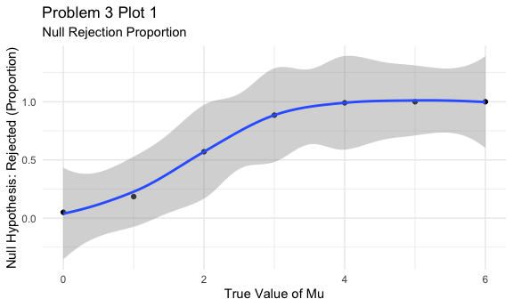
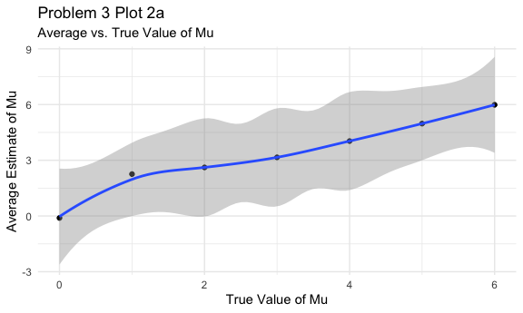
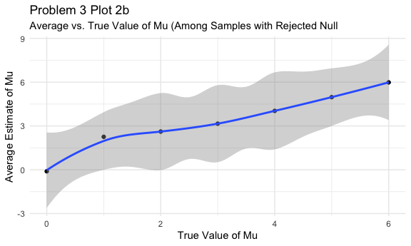

Homework 5
================
Sanjana Batabyal

This is my solution to Homework 5.

``` r
library(tidyverse)
```

    ## ── Attaching packages ─────────────────────────────────────── tidyverse 1.3.0 ──

    ## ✓ ggplot2 3.3.2     ✓ purrr   0.3.4
    ## ✓ tibble  3.0.4     ✓ dplyr   1.0.2
    ## ✓ tidyr   1.1.2     ✓ stringr 1.4.0
    ## ✓ readr   1.4.0     ✓ forcats 0.5.0

    ## ── Conflicts ────────────────────────────────────────── tidyverse_conflicts() ──
    ## x dplyr::filter() masks stats::filter()
    ## x dplyr::lag()    masks stats::lag()

``` r
library(magrittr)
```

    ## 
    ## Attaching package: 'magrittr'

    ## The following object is masked from 'package:purrr':
    ## 
    ##     set_names

    ## The following object is masked from 'package:tidyr':
    ## 
    ##     extract

``` r
library(dplyr)
library(ggplot2)
knitr::opts_chunk$set(fig.width = 6,
  fig.asp = .6,
  out.width = "90%")
theme_set(theme_minimal() + theme(legend.position = "bottom"))
options(ggplot2.continuous.colour = "viridis",
  ggplot2.continuous.fill = "viridis")
scale_colour_discrete = scale_color_viridis_d
scale_fill_discrete = scale_fill_viridis_d
set.seed(1)
```

## Problem 1

Getting the data from the csv file downloaded from GitHub. Cleaning the
data, creating a “resolved” variable, and creating a “city\_state”
variable.

``` r
homicide=
  read_csv("data/homicide-data.csv") %>%
  mutate(city_state=str_c(city, state, sep="_"),
    resolved=case_when(
    disposition=="Closed without arrest" ~ "unsolved",
    disposition=="Closed by arrest" ~ "solved",
    disposition=="Open/No arrest" ~ "unsolved")) %>%
  select(city_state, resolved) %>%
  filter(city_state != "Tulsa_AL")
```

    ## 
    ## ── Column specification ────────────────────────────────────────────────────────
    ## cols(
    ##   uid = col_character(),
    ##   reported_date = col_double(),
    ##   victim_last = col_character(),
    ##   victim_first = col_character(),
    ##   victim_race = col_character(),
    ##   victim_age = col_character(),
    ##   victim_sex = col_character(),
    ##   city = col_character(),
    ##   state = col_character(),
    ##   lat = col_double(),
    ##   lon = col_double(),
    ##   disposition = col_character()
    ## )

The raw data comes from the Washington Post and contains detailed
information about the homicides in 50 U.S. cities from 2012 to 2017. The
dataset contains 52178 rows. The data contains information on the
location of the homicide; the name of the victim; his/her race, age, and
ex; and the conclusion of the case (whether it was resolved or not or if
it is still open).

Filtering the data to group total number of homicides and total number
of unsolved homicides by location.

``` r
agg_hom=
homicide %>%
  group_by(city_state) %>%
  summarize(
    hom_tot=n(),
    hom_unsolved=sum(resolved=="unsolved"),
  )
```

    ## `summarise()` ungrouping output (override with `.groups` argument)

Doing a prop.test on the unsolved homicides in Baltimore, MD.

``` r
prop.test(
  agg_hom %>% filter(city_state=="Baltimore_MD") %>% pull(hom_unsolved),
  agg_hom %>% filter(city_state=="Baltimore_MD") %>% pull(hom_tot)
) %>%
  broom::tidy()
```

    ## # A tibble: 1 x 8
    ##   estimate statistic  p.value parameter conf.low conf.high method    alternative
    ##      <dbl>     <dbl>    <dbl>     <int>    <dbl>     <dbl> <chr>     <chr>      
    ## 1    0.646      239. 6.46e-54         1    0.628     0.663 1-sample… two.sided

Iterating such that we perform a prop.test on each city in the data set.

``` r
hom_results=
agg_hom %>%
  mutate(
    prop_tests=map2(.x=hom_unsolved, .y=hom_tot, ~prop.test(x=.x, n=.y)),
    tidy_tests=map(.x=prop_tests, ~broom::tidy(.x))
  ) %>%
  select(-prop_tests) %>%
  unnest(tidy_tests) %>%
  select(city_state, estimate, conf.low, conf.high)
```

Plotting the results from the previous step.

``` r
hom_results %>%
  mutate(city_state=fct_reorder(city_state, estimate)) %>%
  ggplot(aes(x=city_state, y=estimate)) +
  geom_point() +
  geom_errorbar(aes(ymin=conf.low, ymax=conf.high)) +
  theme(axis.text = element_text(angle=90, vjust=0.5, hjust=1))
```



## Problem 2

Creating a tidy dataframe using iteration in order to import and clean
the datafiles. Then splitting the data set into control and experimental
arms.

``` r
p2data=
  tibble(
    path=list.files("p2data")) %>%  
  mutate(
    path1=str_c("p2data/", path),
    data=map(path1, read_csv)) %>% 
  unnest(data) %>%
  separate(
    path1,
    into = c(NA, "Arm", "Arm_Num", NA)) %>%
  pivot_longer(
    starts_with("week"),
    names_to = "week",
    values_to = "values") %>%
  mutate(
    week = as.numeric(sub("week_", "", week)))
```

    ## 
    ## ── Column specification ────────────────────────────────────────────────────────
    ## cols(
    ##   week_1 = col_double(),
    ##   week_2 = col_double(),
    ##   week_3 = col_double(),
    ##   week_4 = col_double(),
    ##   week_5 = col_double(),
    ##   week_6 = col_double(),
    ##   week_7 = col_double(),
    ##   week_8 = col_double()
    ## )
    ## 
    ## 
    ## ── Column specification ────────────────────────────────────────────────────────
    ## cols(
    ##   week_1 = col_double(),
    ##   week_2 = col_double(),
    ##   week_3 = col_double(),
    ##   week_4 = col_double(),
    ##   week_5 = col_double(),
    ##   week_6 = col_double(),
    ##   week_7 = col_double(),
    ##   week_8 = col_double()
    ## )
    ## 
    ## 
    ## ── Column specification ────────────────────────────────────────────────────────
    ## cols(
    ##   week_1 = col_double(),
    ##   week_2 = col_double(),
    ##   week_3 = col_double(),
    ##   week_4 = col_double(),
    ##   week_5 = col_double(),
    ##   week_6 = col_double(),
    ##   week_7 = col_double(),
    ##   week_8 = col_double()
    ## )
    ## 
    ## 
    ## ── Column specification ────────────────────────────────────────────────────────
    ## cols(
    ##   week_1 = col_double(),
    ##   week_2 = col_double(),
    ##   week_3 = col_double(),
    ##   week_4 = col_double(),
    ##   week_5 = col_double(),
    ##   week_6 = col_double(),
    ##   week_7 = col_double(),
    ##   week_8 = col_double()
    ## )
    ## 
    ## 
    ## ── Column specification ────────────────────────────────────────────────────────
    ## cols(
    ##   week_1 = col_double(),
    ##   week_2 = col_double(),
    ##   week_3 = col_double(),
    ##   week_4 = col_double(),
    ##   week_5 = col_double(),
    ##   week_6 = col_double(),
    ##   week_7 = col_double(),
    ##   week_8 = col_double()
    ## )
    ## 
    ## 
    ## ── Column specification ────────────────────────────────────────────────────────
    ## cols(
    ##   week_1 = col_double(),
    ##   week_2 = col_double(),
    ##   week_3 = col_double(),
    ##   week_4 = col_double(),
    ##   week_5 = col_double(),
    ##   week_6 = col_double(),
    ##   week_7 = col_double(),
    ##   week_8 = col_double()
    ## )
    ## 
    ## 
    ## ── Column specification ────────────────────────────────────────────────────────
    ## cols(
    ##   week_1 = col_double(),
    ##   week_2 = col_double(),
    ##   week_3 = col_double(),
    ##   week_4 = col_double(),
    ##   week_5 = col_double(),
    ##   week_6 = col_double(),
    ##   week_7 = col_double(),
    ##   week_8 = col_double()
    ## )
    ## 
    ## 
    ## ── Column specification ────────────────────────────────────────────────────────
    ## cols(
    ##   week_1 = col_double(),
    ##   week_2 = col_double(),
    ##   week_3 = col_double(),
    ##   week_4 = col_double(),
    ##   week_5 = col_double(),
    ##   week_6 = col_double(),
    ##   week_7 = col_double(),
    ##   week_8 = col_double()
    ## )
    ## 
    ## 
    ## ── Column specification ────────────────────────────────────────────────────────
    ## cols(
    ##   week_1 = col_double(),
    ##   week_2 = col_double(),
    ##   week_3 = col_double(),
    ##   week_4 = col_double(),
    ##   week_5 = col_double(),
    ##   week_6 = col_double(),
    ##   week_7 = col_double(),
    ##   week_8 = col_double()
    ## )
    ## 
    ## 
    ## ── Column specification ────────────────────────────────────────────────────────
    ## cols(
    ##   week_1 = col_double(),
    ##   week_2 = col_double(),
    ##   week_3 = col_double(),
    ##   week_4 = col_double(),
    ##   week_5 = col_double(),
    ##   week_6 = col_double(),
    ##   week_7 = col_double(),
    ##   week_8 = col_double()
    ## )
    ## 
    ## 
    ## ── Column specification ────────────────────────────────────────────────────────
    ## cols(
    ##   week_1 = col_double(),
    ##   week_2 = col_double(),
    ##   week_3 = col_double(),
    ##   week_4 = col_double(),
    ##   week_5 = col_double(),
    ##   week_6 = col_double(),
    ##   week_7 = col_double(),
    ##   week_8 = col_double()
    ## )
    ## 
    ## 
    ## ── Column specification ────────────────────────────────────────────────────────
    ## cols(
    ##   week_1 = col_double(),
    ##   week_2 = col_double(),
    ##   week_3 = col_double(),
    ##   week_4 = col_double(),
    ##   week_5 = col_double(),
    ##   week_6 = col_double(),
    ##   week_7 = col_double(),
    ##   week_8 = col_double()
    ## )
    ## 
    ## 
    ## ── Column specification ────────────────────────────────────────────────────────
    ## cols(
    ##   week_1 = col_double(),
    ##   week_2 = col_double(),
    ##   week_3 = col_double(),
    ##   week_4 = col_double(),
    ##   week_5 = col_double(),
    ##   week_6 = col_double(),
    ##   week_7 = col_double(),
    ##   week_8 = col_double()
    ## )
    ## 
    ## 
    ## ── Column specification ────────────────────────────────────────────────────────
    ## cols(
    ##   week_1 = col_double(),
    ##   week_2 = col_double(),
    ##   week_3 = col_double(),
    ##   week_4 = col_double(),
    ##   week_5 = col_double(),
    ##   week_6 = col_double(),
    ##   week_7 = col_double(),
    ##   week_8 = col_double()
    ## )
    ## 
    ## 
    ## ── Column specification ────────────────────────────────────────────────────────
    ## cols(
    ##   week_1 = col_double(),
    ##   week_2 = col_double(),
    ##   week_3 = col_double(),
    ##   week_4 = col_double(),
    ##   week_5 = col_double(),
    ##   week_6 = col_double(),
    ##   week_7 = col_double(),
    ##   week_8 = col_double()
    ## )
    ## 
    ## 
    ## ── Column specification ────────────────────────────────────────────────────────
    ## cols(
    ##   week_1 = col_double(),
    ##   week_2 = col_double(),
    ##   week_3 = col_double(),
    ##   week_4 = col_double(),
    ##   week_5 = col_double(),
    ##   week_6 = col_double(),
    ##   week_7 = col_double(),
    ##   week_8 = col_double()
    ## )
    ## 
    ## 
    ## ── Column specification ────────────────────────────────────────────────────────
    ## cols(
    ##   week_1 = col_double(),
    ##   week_2 = col_double(),
    ##   week_3 = col_double(),
    ##   week_4 = col_double(),
    ##   week_5 = col_double(),
    ##   week_6 = col_double(),
    ##   week_7 = col_double(),
    ##   week_8 = col_double()
    ## )
    ## 
    ## 
    ## ── Column specification ────────────────────────────────────────────────────────
    ## cols(
    ##   week_1 = col_double(),
    ##   week_2 = col_double(),
    ##   week_3 = col_double(),
    ##   week_4 = col_double(),
    ##   week_5 = col_double(),
    ##   week_6 = col_double(),
    ##   week_7 = col_double(),
    ##   week_8 = col_double()
    ## )
    ## 
    ## 
    ## ── Column specification ────────────────────────────────────────────────────────
    ## cols(
    ##   week_1 = col_double(),
    ##   week_2 = col_double(),
    ##   week_3 = col_double(),
    ##   week_4 = col_double(),
    ##   week_5 = col_double(),
    ##   week_6 = col_double(),
    ##   week_7 = col_double(),
    ##   week_8 = col_double()
    ## )
    ## 
    ## 
    ## ── Column specification ────────────────────────────────────────────────────────
    ## cols(
    ##   week_1 = col_double(),
    ##   week_2 = col_double(),
    ##   week_3 = col_double(),
    ##   week_4 = col_double(),
    ##   week_5 = col_double(),
    ##   week_6 = col_double(),
    ##   week_7 = col_double(),
    ##   week_8 = col_double()
    ## )

``` r
control= 
  p2data %>% 
  select(Arm, Arm_Num, week, values) %>%
  filter(Arm=="con")
experiment=
  p2data %>% 
  select(Arm, Arm_Num, week, values) %>%
  filter(Arm=="exp")
```

Creating a spaghetti plot that shows observations on each subject over
time.

``` r
spaghetti=ggplot(control, aes(x=week, y=values, group=Arm)) +
  geom_line() + 
  geom_line(data=experiment, color="green")

spaghetti + 
  labs(title="Observations on Each Subject Over Time",
    subtitle="Black = Control Group, Blue = Experimental Group",
    x="Week",
    y="Observations")
```


Looking at the control group (colored in black), we see that their
scores tend to go down throughout the week while the experimental group
(colored in green) has scores that increase throughout the week. The
range of scores is more stable among the control group than the
experimental group, but they do have opposite trends.

\#\#Problem 3 Setting up the simulation, generating 5000 datasets from
the model, creating an iteration for mu=1-6, and then creating a
sub-dataset that includes when the null was rejected and when we failed
to reject it.

``` r
p3sim_setup=function(n=30, mu, sigma=5)
{input_sim = 
  tibble(
  x=rnorm(n=30, mean=mu, sd=5)) %>%
    t.test() %>%
    broom::tidy()}

p3sim_1= 
  rerun(5000, p3sim_setup(n=30, mu=0, sigma=5)) %>% 
  bind_rows()

p3sim= 
  tibble(
  mu=c(0, 1, 2, 3, 4, 5, 6)) %>% 
  mutate(
    output=map(.x=mu, ~ rerun(5000, 
    p3sim_setup(n=30, mu = .x, sigma=5))),
    results = map(output, bind_rows)) %>% 
  select(-output) %>%
  unnest(results) %>% 
  select(mu, estimate, p.value) %>% 
  mutate(
    null_outcome=case_when(
      p.value <= 0.05~"Rejected",
      p.value > 0.05~"Fail to Reject"))
```

Creating a plot showing the proportion of times the null was rejected
(the power of the test) on the y axis and the true value of μ on the x
axis.

``` r
p3sim_reject=
  p3sim%>% 
  group_by(mu, null_outcome) %>% 
  filter(null_outcome=="Rejected") %>% 
  summarize(total=n()) %>% 
  mutate(prop=total/5000) 
```

    ## `summarise()` regrouping output by 'mu' (override with `.groups` argument)

``` r
p3sim_reject %>% 
  ggplot(aes(x=mu, y=prop)) +
  geom_point() + geom_smooth() +
  labs(title="Problem 3 Plot 1",
    subtitle="Null Rejection Proportion",
    x="True Value of Mu",
    y="Null Hypothesis: Rejected (Proportion)")
```

    ## `geom_smooth()` using method = 'loess' and formula 'y ~ x'


We see here that as the true value of mu, or effect size, increases, the
proportion of times the null hypothesis was rejected, or power, also
increases. This makes sense because we know that a larger effect size
contributes to larger power. However, this is not an infinitely positive
relationship; we see that power levels off at 1 and this also makes
sense because the greatest value power can be is 1.

Making a plot showing the average estimate of μ̂ on the y axis and the
true value of μ on the x axis.

``` r
p3sim_average=
  p3sim%>% 
  group_by(mu) %>% 
  filter(null_outcome=="Rejected") %>% 
  summarize(average=mean(estimate)) 
```

    ## `summarise()` ungrouping output (override with `.groups` argument)

``` r
p3sim_average %>% 
  ggplot(aes(x=mu, y=average)) +
  geom_point() + geom_smooth() +
  labs(title="Problem 3 Plot 2a",
    subtitle="Average vs. True Value of Mu",
    x="True Value of Mu",
    y="Average Estimate of Mu")
```

    ## `geom_smooth()` using method = 'loess' and formula 'y ~ x'


Making a plot of average estimate of μ̂ only in samples for which the
null was rejected on the y axis and the true value of μ on the x axis.

``` r
p3sim_average2=
  p3sim%>% 
  group_by(mu) %>% 
  filter(null_outcome=="Rejected") %>% 
  summarize(average2=mean(estimate))
```

    ## `summarise()` ungrouping output (override with `.groups` argument)

``` r
p3sim_average2 %>% 
  ggplot(aes(x=mu, y=average2)) +
  geom_point() + geom_smooth() +
  labs(title="Problem 3 Plot 2b",
    subtitle="Average vs. True Value of Mu (Among Samples with Rejected Null",
    x="True Value of Mu",
    y="Average Estimate of Mu")
```

    ## `geom_smooth()` using method = 'loess' and formula 'y ~ x'


Looking at these two plots, we see that the sample average of mu across
tests when the null hypothesis is rejected is approximately equal to the
true value of mu. This makes sense because when you have a larger effect
size, you have a higher power, and you are more likely to reject the
null hypothesis (and the converse of this statement is true as well).
