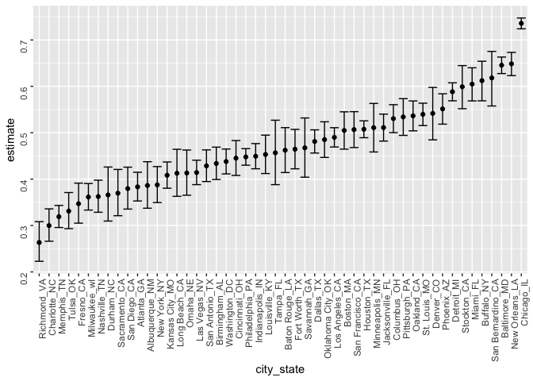

Homework 5
================
Sanjana Batabyal

This is my solution to Homework 5.

``` r
library(tidyverse)
```

    ## ── Attaching packages ─────────────────────────────────────── tidyverse 1.3.0 ──

    ## ✓ ggplot2 3.3.2     ✓ purrr   0.3.4
    ## ✓ tibble  3.0.4     ✓ dplyr   1.0.2
    ## ✓ tidyr   1.1.2     ✓ stringr 1.4.0
    ## ✓ readr   1.4.0     ✓ forcats 0.5.0

    ## ── Conflicts ────────────────────────────────────────── tidyverse_conflicts() ──
    ## x dplyr::filter() masks stats::filter()
    ## x dplyr::lag()    masks stats::lag()

``` r
library(magrittr)
```

    ## 
    ## Attaching package: 'magrittr'

    ## The following object is masked from 'package:purrr':
    ## 
    ##     set_names

    ## The following object is masked from 'package:tidyr':
    ## 
    ##     extract

``` r
library(dplyr)
library(ggplot2)
```

## Problem 1

Getting the data from the csv file downloaded from GitHub. Cleaning the
data, creating a “resolved” variable, and creating a “city\_state”
variable.

``` r
homicide=
  read_csv("data/homicide-data.csv") %>%
  mutate(
    city_state=str_c(city, state, sep="_"),
    resolved=case_when(
    disposition=="Closed without arrest" ~ "unsolved",
    disposition=="Closed by arrest" ~ "solved",
    disposition=="Open/No arrest" ~ "unsolved")
  ) %>%
  select(city_state, resolved) %>%
  filter(city_state != "Tulsa_AL")
```

    ## 
    ## ── Column specification ────────────────────────────────────────────────────────
    ## cols(
    ##   uid = col_character(),
    ##   reported_date = col_double(),
    ##   victim_last = col_character(),
    ##   victim_first = col_character(),
    ##   victim_race = col_character(),
    ##   victim_age = col_character(),
    ##   victim_sex = col_character(),
    ##   city = col_character(),
    ##   state = col_character(),
    ##   lat = col_double(),
    ##   lon = col_double(),
    ##   disposition = col_character()
    ## )

The raw data comes from the Washington Post and contains detailed
information about the homicides in 50 U.S. cities from 2012 to 2017. The
dataset contains \`52178 rows. The data contains information on the
location of the homicide; the name of the victim; his/her race, age, and
ex; and the conclusion of the case (whether it was resolved or not or if
it is still open).

Filtering the data to group total number of homicides and total number
of unsolved homicides by location.

``` r
agg_hom=
homicide %>%
  group_by(city_state) %>%
  summarize(
    hom_tot=n(),
    hom_unsolved=sum(resolved=="unsolved"),
  )
```

    ## `summarise()` ungrouping output (override with `.groups` argument)

Doing a prop.test on the unsolved homicides in Baltimore, MD.

``` r
prop.test(
  agg_hom %>% filter(city_state=="Baltimore_MD") %>% pull(hom_unsolved),
  agg_hom %>% filter(city_state=="Baltimore_MD") %>% pull(hom_tot)
) %>%
  broom::tidy()
```

    ## # A tibble: 1 x 8
    ##   estimate statistic  p.value parameter conf.low conf.high method    alternative
    ##      <dbl>     <dbl>    <dbl>     <int>    <dbl>     <dbl> <chr>     <chr>      
    ## 1    0.646      239. 6.46e-54         1    0.628     0.663 1-sample… two.sided

Iterating such that we perform a prop.test on each city in the data set.

``` r
hom_results=
agg_hom %>%
  mutate(
    prop_tests=map2(.x=hom_unsolved, .y=hom_tot, ~prop.test(x=.x, n=.y)),
    tidy_tests=map(.x=prop_tests, ~broom::tidy(.x))
  ) %>%
  select(-prop_tests) %>%
  unnest(tidy_tests) %>%
  select(city_state, estimate, conf.low, conf.high)
```

Plotting the results from the previous step.

``` r
hom_results %>%
  mutate(city_state=fct_reorder(city_state, estimate)) %>%
  ggplot(aes(x=city_state, y=estimate)) +
  geom_point() +
  geom_errorbar(aes(ymin=conf.low, ymax=conf.high)) +
  theme(axis.text = element_text(angle=90, vjust=0.5, hjust=1))
```

<!-- -->
